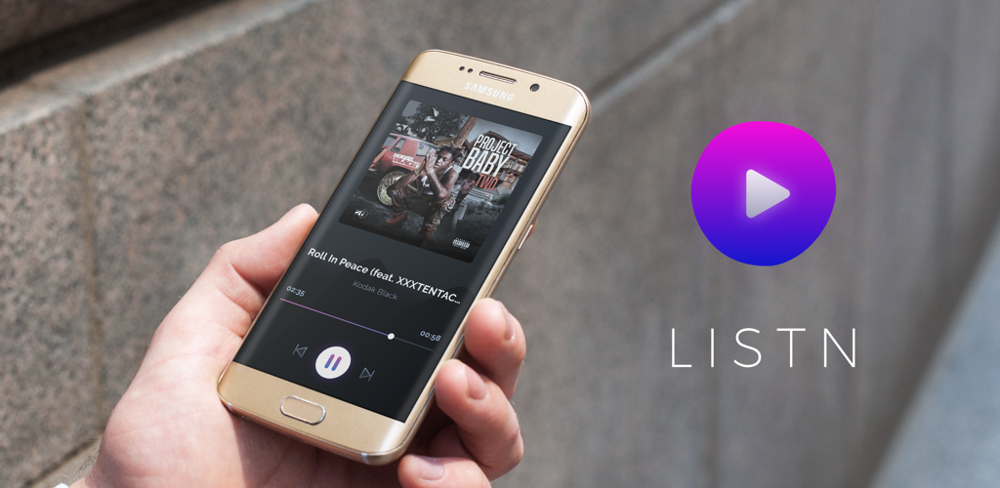

# Listn   

    

Simple music player app built on top of the Soundcloud API. The app is built with Uncle Bob's Clean Architecture, loosely inspired by [this project](https://github.com/android10/Android-CleanArchitecture). The audio player is inspired by [this project].(https://github.com/googlesamples/android-UniversalMusicPlayer)
App requires a Soundcloud API key to use properly.

    

## Used Libraries
* __Dagger2__ 
* __RxJava/RxAndroid__ 
* __Android Data Binding Library__
* __FirebaseCore (for crash reporting)__
* __Picasso__

Libraries for testing
* __JUnit__
* __Mockito__

